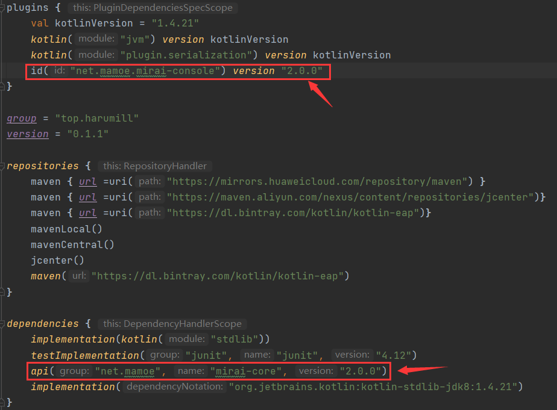
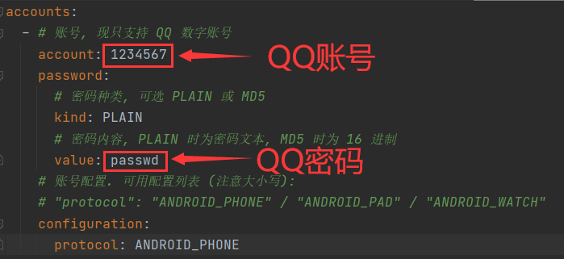
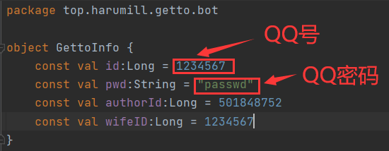

# GettoBot
## 0.说明
### （1）GettoBot为个人自用QQbot，根据MIT License开源
### （2）GettoBot基于[Mirai框架](https://github.com/mamoe/mirai) 及 [MiraiConsole项目](https://github.com/mamoe/mirai-console)
### （3）GettoBot中的Getto来源于日本俳人青木月斗的日文发音（げっと)
### （4）GettoBot为插件式bot，其开发参考了[此教程](https://blog.csdn.net/qq_40832960/article/details/111830412?utm_medium=distribute.pc_relevant.none-task-blog-baidujs_title-3&spm=1001.2101.3001.4242) ,特此表示感谢
## 1.使用
### （1）以下均默认您已安装并成功配置MiraiConsoleLoader（以下略称mcl），若您还不知道如何使用mcl，请参照[官方文档](https://github.com/mamoe/mirai-console/blob/master/docs/Run.md)
### （2）直接使用
若您需要直接使用，请在[release](https://github.com/Mill413/GettoBot/releases) 页面下载最新版本的jar包，并放入plugins目录中
### （3）修改源码
若您需要自行修改代码，以实现自定义功能，请参照[2.维护](#2.维护)
## 2.维护
### （1）build.gradle.kts 中更新mirai-console以及mirai-core版本
### （2）在 config/Console/Autologin.yml 中修改bot账号，密码
### （3）在 src/main/kotlin/top/harumill/getto/bot/GettoInfo.kt 中修改bot账号，密码
**说明:** authorId为作者id，请勿骚扰
### （4）在 src/main/kotlin/top/harumill/getto/PluginMain.kt 中编写代码，编写教程可参考源代码或[此篇教程](https://blog.csdn.net/qq_40832960/article/details/111830412?utm_medium=distribute.pc_relevant.none-task-blog-baidujs_title-3&spm=1001.2101.3001.4242) 及[mirai官方文档](https://github.com/mamoe/mirai/blob/dev/docs/README.md)